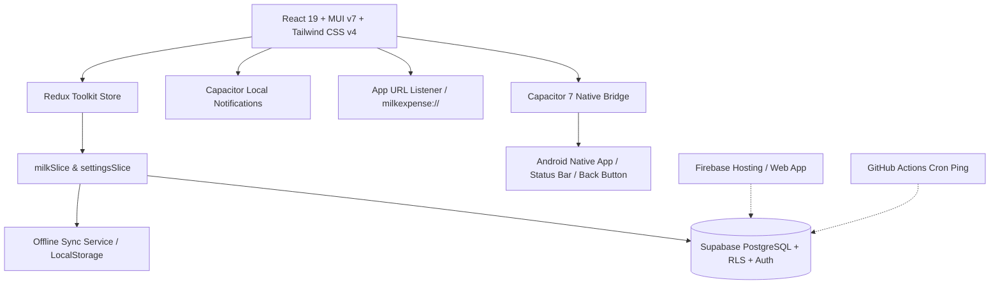

# 🥛 Milk Expense Tracker

A modern, offline-first daily milk expense tracking mobile and web application. Designed to simplify daily milk logging, expense calculations, and monthly settlement reconciliation for households and delivery vendors.

Built with **React 19**, **TypeScript**, **Redux Toolkit**, **Supabase (PostgreSQL & Row Level Security)**, **Material UI (MUI v7)**, **Tailwind CSS v4**, and packaged for native Android with **Capacitor 7**. Deployed on **Firebase Hosting** and configured with native deep linking for seamless password recovery.

---

## 📌 Table of Contents

- [Overview & Problem Statement](#-overview--problem-statement)
- [Key Features](#-key-features)
- [Billing Cycle & Calculation Engine](#-billing-cycle--calculation-engine)
- [Architecture & Tech Stack](#-architecture--tech-stack)
- [Database & Data Schema (PostgreSQL + RLS)](#-database--data-schema-postgresql--rls)
- [Project Directory Structure](#-project-directory-structure)
- [Getting Started & Local Setup](#-getting-started--local-setup)
- [Mobile Development (Android / Capacitor)](#-mobile-development-android--capacitor)
- [Web Deployment & Password Reset Deep Linking](#-web-deployment--password-reset-deep-linking)
- [Automated Supabase Keep-Alive Action](#-automated-supabase-keep-alive-action)
- [Available Scripts](#-available-scripts)

---

## 📖 Overview & Problem Statement

In many households across India and other regions, milk is delivered daily by local vendors with non-standard billing schedules. Traditional calendar month billing (1st to 30th/31st) does not match vendor practices:
- **Billing cycles typically run from the 10th of the previous month to the 9th of the current month**, with payments due on the 10th.
- Quantities fluctuate day-to-day (e.g., 0.5L, 1L, 1.5L, 2L, or 0L on skip days).
- Price per liter changes periodically over time.
- Manually tallying dues using paper calendars or chat messages causes calculation errors and disputes.

**Milk Expense Tracker** solves this with an automated, synchronized, and mobile-friendly system that manages daily logs, enforces billing cycle rules, preserves historic pricing integrity, calculates dues in real time, and tracks payment settlement status.

---

## ✨ Key Features

### 1. 📅 Daily Entry Management & Visual Calendar
- **Quick Logging:** Record daily deliveries in seconds with standardized quantity buttons (0.5L, 1L, 1.5L, 2L).
- **Delivery Status Toggle:** Switch between milk taken or skipped with a single tap.
- **Date Picker with Pre-fill:** Select any past or current date using day-first date formatting (`DD/MM/YYYY`). Existing logs automatically pre-fill for fast editing.
- **Interactive Calendar / Heatmap View:** Switch between tabular view and a monthly calendar heatmap with color-coded badges:
  - 🥛 **Delivered** (`1.5 L`)
  - 🚫 **Skipped**
  - ⏳ **Pending**
- **1-Tap Calendar Quick Logging:** Tap any date cell directly in the heatmap to log or modify delivery details.
- **Paid Period Freeze:** Automatically locks edits for dates belonging to billing cycles marked as **Paid**, preserving historical data integrity.

### 2. 📊 Historical Billing Dashboard & Batched Lazy Loading
- **Complete Billing History:** View all historical and current billing periods sorted chronologically.
- **Batched Lazy Loading & Infinite Scroll:** Historical billing cycles load in lightweight batches (`BATCH_SIZE = 4`) with an `IntersectionObserver` sentinel and manual fallback, avoiding heavy initial data queries.
- **Year Filter:** Filter periods by year (`All`, `2025`, `2026`, etc.) for quick navigation.
- **Real-Time Financial Totals:** Instant computation of `Total Liters × Effective Rate = Total Amount Due (₹)`.
- **Settlement Status Toggle:** Mark billing cycles as **Paid** or **Unpaid** with instant ledger recording.

### 3. 📈 Effective Milk Rate Versioning
- **Historic Price Protection:** Each rate update is recorded in `milk_rates` with an `effective_from` date.
- **Immutable Historical Computations:** Prior billing cycles calculate against the rate that was active during that cycle, ensuring rate revisions never alter historical statements.

### 4. 📱 1-Tap WhatsApp Itemized Bill Sharing
- **Shareable WhatsApp Statements:** Generates a formatted bill receipt directly shareable to WhatsApp:
  - Billing cycle dates and settlement due date.
  - Total liters consumed and effective rate per liter.
  - Final calculated amount due (₹).
  - Itemized list of all skipped delivery dates for complete vendor transparency.

### 5. 💸 1-Click UPI Deep Links & QR Code
- **Mobile UPI Intent:** Launches Google Pay, PhonePe, Paytm, or BHIM directly on mobile via `upi://pay` deep links pre-filled with the vendor's UPI ID, name, and exact bill amount.
- **Desktop Scan-and-Pay QR:** Generates an on-screen UPI QR code for desktop users to scan from their phone.

### 6. 📒 Khata / Advance Carryover Ledger
- **Running Ledger Balance:** Record payments, partial dues, or extra advances with automatic carryover calculations.
- **Payment History Notes:** Track payment methods, transaction references, or notes per billing cycle.

### 7. 📊 Paid Months Analytics & Reports
- **Annual Analytics Dashboard:** Filter reports by year to review annual expenditure, total liters consumed, and monthly spend averages.
- **Itemized Cycle Breakdown:** Expand any settled month to view a complete daily delivery audit log.

### 8. ⚡ Offline Doorstep Logging & Background Sync
- **Local Cache (`offlineSyncService`):** Fast startup and zero-delay entry review using local browser storage.
- **Offline Mutation Queue:** Allows logging deliveries at the doorstep even without cellular connectivity; automatically synchronizes pending changes with Supabase once back online.

### 9. 🔔 Scheduled Local Daily Reminders
- **Custom Reminder Time:** Set a daily notification time (default: 8:30 PM) via `@capacitor/local-notifications`.
- **Native Android Alerts:** Delivers native notifications reminding you to log daily deliveries.
- **In-App Test Trigger:** Instant test alert button to verify notification permissions.

### 10. 🔐 Pure-Email Authentication & Password Recovery
- **Modern Segmented Auth UI:** Clean, distraction-free email authentication with "Sign In" and "Create Account" segmented tabs, input adornments, and password visibility toggles.
- **Android Deep Linking (`milkexpense://`):** Seamless redirection from password recovery emails into the native Android application.
- **Firebase Hosting Web Portal:** Fallback web-hosted redirect (`https://milkmanager-c700b.web.app`) for universal web recovery.
- **Global Reset Modal:** In-app `SetNewPasswordModal` automatically prompts users to set a new password upon authenticated recovery link opening.

### 11. 🎨 Cross-Platform Mobile Experience & Theming
- **Native Android APK:** Packaged with Capacitor 7 with full Android hardware back-button handling and exit confirmation.
- **Adaptive App Icons & Branding:** Polished adaptive WebP launcher icons and display name set to **"Milk Expense"**.
- **Dynamic Status Bar:** Automatically adapts the native Android status bar color and icon style based on light (`#ffffff`) or dark (`#1e293b`) mode.
- **Theme Switcher:** Seamless Dark / Light mode toggle powered by Material UI and Tailwind CSS.

### 12. ⏰ Automated Supabase Keep-Alive
- **Inactivity Prevention:** GitHub Action workflow pings the Supabase REST API every 3 days at 06:00 UTC to prevent free-tier database inactivity pause.

---

## 🧮 Billing Cycle & Calculation Engine

### Custom Billing Cycle Logic
Unlike standard calendar months, this application operates on a **10th-to-9th** cycle:
- **Billing Period Formula:**
  - Dates from **Day 1 to Day 9** belong to the **current calendar month's** billing cycle.
  - Dates from **Day 10 to Day 31** belong to the **next calendar month's** billing cycle.
- **Example:**
  - `2025-10-10` to `2025-11-09` = Billing Period **`2025-11`** (Settlement Date: Nov 10th)
  - `2025-11-10` to `2025-12-09` = Billing Period **`2025-12`** (Settlement Date: Dec 10th)

### Financial Formulas
$$\text{Total Liters (Period)} = \sum_{i \in \text{Period}} (\text{entry}_i.\text{milk\_taken} \ ? \ \text{entry}_i.\text{quantity} : 0)$$

$$\text{Amount Due (₹)} = \text{Total Liters (Period)} \times \text{Effective Rate}$$

---

## 🧱 Architecture & Tech Stack



### Core Technologies
| Layer | Technology | Purpose |
|---|---|---|
| **Frontend Framework** | [React 19](https://react.dev/) | Reactive component architecture |
| **Language** | [TypeScript 5.9](https://www.typescriptlang.org/) | Strict type contracts and compile-time safety |
| **Bundler / Build** | [Vite (Rolldown engine)](https://vite.dev/) | High-performance HMR and production builds |
| **State Management** | [Redux Toolkit 2.x](https://redux-toolkit.js.org/) | Global state, asynchronous thunks, and cache management |
| **UI Framework** | [Material UI (MUI v7)](https://mui.com/) | Accessible design system, date pickers, dialogs, and icons |
| **Utility Styling** | [Tailwind CSS v4](https://tailwindcss.com/) | Responsive utility classes |
| **Database & Auth** | [Supabase](https://supabase.com/) | PostgreSQL database, Row Level Security, and JWT Auth |
| **Mobile Runtime** | [Capacitor 7](https://capacitorjs.com/) | Android native bridge, status bar, and app URL listeners |
| **Notifications** | [@capacitor/local-notifications](https://capacitorjs.com/docs/apis/local-notifications) | Offline native Android daily delivery alerts |
| **Web Hosting** | [Firebase Hosting](https://firebase.google.com/docs/hosting) | Fast, free SSL hosting and web password recovery portal |

---

## 🗄️ Database & Data Schema (PostgreSQL + RLS)

All tables are protected by Supabase **Row Level Security (RLS)** ensuring users only query and mutate their own records (`auth.uid() = user_id`).

### 1. `milk_entries`
Stores individual daily delivery records:
```sql
CREATE TABLE milk_entries (
  id UUID PRIMARY KEY DEFAULT gen_random_uuid(),
  user_id UUID NOT NULL REFERENCES auth.users(id) ON DELETE CASCADE,
  entry_date DATE NOT NULL,
  milk_taken BOOLEAN NOT NULL DEFAULT true,
  quantity NUMERIC(4, 2) NOT NULL DEFAULT 1.0,
  billing_period TEXT NOT NULL, -- e.g. '2025-11'
  created_at TIMESTAMPTZ DEFAULT now(),
  updated_at TIMESTAMPTZ DEFAULT now(),
  UNIQUE (user_id, entry_date)
);
```

### 2. `billing_periods`
Tracks settlement and aggregate totals per billing cycle:
```sql
CREATE TABLE billing_periods (
  id UUID PRIMARY KEY DEFAULT gen_random_uuid(),
  user_id UUID NOT NULL REFERENCES auth.users(id) ON DELETE CASCADE,
  billing_period TEXT NOT NULL, -- e.g. '2025-11'
  payment_status TEXT NOT NULL DEFAULT 'Unpaid', -- 'Paid' | 'Unpaid'
  total_liters NUMERIC(6, 2) DEFAULT 0.0,
  effective_rate NUMERIC(6, 2) DEFAULT 0.0,
  total_amount NUMERIC(8, 2) DEFAULT 0.0,
  paid_at TIMESTAMPTZ,
  updated_at TIMESTAMPTZ DEFAULT now(),
  UNIQUE (user_id, billing_period)
);
```

### 3. `milk_rates`
Historic versioning of milk prices:
```sql
CREATE TABLE milk_rates (
  id UUID PRIMARY KEY DEFAULT gen_random_uuid(),
  user_id UUID NOT NULL REFERENCES auth.users(id) ON DELETE CASCADE,
  rate NUMERIC(6, 2) NOT NULL, -- e.g. 55.00
  effective_from DATE NOT NULL, -- e.g. '2025-01-01'
  created_at TIMESTAMPTZ DEFAULT now(),
  UNIQUE (user_id, effective_from)
);
```

### 4. `user_settings`
User-level preferences, vendor details, and reminder settings:
```sql
CREATE TABLE user_settings (
  user_id UUID PRIMARY KEY REFERENCES auth.users(id) ON DELETE CASCADE,
  cycle_start_day INT DEFAULT 10,
  daily_reminder_enabled BOOLEAN DEFAULT true,
  delivery_time TEXT DEFAULT '20:30',
  vendor_name TEXT,
  vendor_phone TEXT,
  vendor_upi TEXT,
  updated_at TIMESTAMPTZ DEFAULT now()
);
```

### 5. `payment_ledger`
Ledger for tracking advance carryovers and partial payments:
```sql
CREATE TABLE payment_ledger (
  id UUID PRIMARY KEY DEFAULT gen_random_uuid(),
  user_id UUID NOT NULL REFERENCES auth.users(id) ON DELETE CASCADE,
  period TEXT NOT NULL,
  amount_due NUMERIC(8, 2) NOT NULL,
  amount_paid NUMERIC(8, 2) NOT NULL,
  carryover_balance NUMERIC(8, 2) DEFAULT 0.0,
  notes TEXT,
  created_at TIMESTAMPTZ DEFAULT now()
);
```

---

## 📁 Project Directory Structure

```
.
├── .github/
│   └── workflows/
│       └── supabase-keep-alive.yml # Automated 3-day Supabase activity cron
├── android/                        # Capacitor Android native project
│   └── app/src/main/
│       ├── AndroidManifest.xml     # Deep linking & notification permissions
│       └── res/                    # Adaptive WebP icons and strings.xml
├── public/                         # Favicon and static assets
├── scripts/                        # Migration scripts (Firestore -> Supabase)
├── src/
│   ├── assets/                     # Application logos and graphics
│   ├── components/                 # Modular UI components
│   │   ├── BillingCycleEditor.tsx       # Cycle day configuration
│   │   ├── DailyCalendarView.tsx        # Heatmap calendar view with quick logging
│   │   ├── DailyEntriesTable.tsx        # Tabular daily entries with filtering
│   │   ├── DailyEntryForm.tsx           # Entry creation form & quantity selectors
│   │   ├── MonthlySummary.tsx           # Dashboard billing cycle summary card
│   │   ├── Navbar.tsx                   # Top navigation bar, title & theme toggle
│   │   ├── PrivateRoute.tsx             # Auth route guard
│   │   ├── RateEditor.tsx               # Effective milk rate manager
│   │   ├── ReminderSettingsEditor.tsx   # Daily reminder configuration & test button
│   │   ├── SetNewPasswordModal.tsx      # In-app password reset modal
│   │   ├── UpiPayButton.tsx             # UPI deep link & QR code payment modal
│   │   ├── VendorSettingsEditor.tsx     # Vendor contact & UPI ID settings
│   │   └── WhatsAppShareButton.tsx      # WhatsApp itemized bill generator
│   ├── context/
│   │   ├── AuthContext.tsx              # Supabase auth session & recovery tracking
│   │   └── ThemeContext.tsx             # Dark/Light theme state
│   ├── pages/
│   │   ├── DashboardPage.tsx            # Historical cycles with batched lazy loading
│   │   ├── HomePage.tsx                 # Daily entry form, table & calendar view
│   │   ├── LoginPage.tsx                # Pure-email authentication & recovery form
│   │   ├── ReportsPage.tsx              # Paid months reports & annual breakdown
│   │   └── SettingsPage.tsx             # Vendor, rate, reminder, & cycle settings
│   ├── services/
│   │   ├── notificationService.ts       # Local notification scheduling & triggers
│   │   └── offlineSyncService.ts        # LocalStorage cache & offline mutation queue
│   ├── store/
│   │   ├── milkSlice.ts                 # Redux slice for entries & offline sync
│   │   ├── settingsSlice.ts             # Redux slice for rates, settings & ledger
│   │   └── store.ts                     # Redux store configuration
│   ├── supabase/
│   │   └── client.ts                    # Supabase client initialization
│   ├── types/
│   │   └── index.ts                     # TypeScript data interfaces
│   ├── utils/
│   │   └── dateUtils.ts                 # 10th-to-9th billing period calculation engine
│   ├── App.tsx                          # App root, Capacitor listeners, deep linking
│   ├── main.tsx                         # React entry point
│   └── index.css                        # Tailwind v4 and global styles
├── capacitor.config.ts             # Capacitor project configuration
├── firebase.json                   # Firebase Hosting configuration
├── package.json                    # Dependencies and scripts
└── vite.config.ts                  # Vite build config with Tailwind plugin
```

---

## 🚀 Getting Started & Local Setup

### 1. Prerequisites
- [Node.js](https://nodejs.org/) (v18 or later)
- [pnpm](https://pnpm.io/) package manager (`npm install -g pnpm`)
- A [Supabase](https://supabase.com/) project with the database schema applied

### 2. Clone & Navigate
```bash
git clone https://github.com/ajaypds/milk-expense-tracker.git
cd milk-expense-src
```

### 3. Install Dependencies
```bash
pnpm install
```

### 4. Configure Environment Variables
Create a `.env` file in the project root:
```env
VITE_SUPABASE_URL="https://your-project-id.supabase.co"
VITE_SUPABASE_ANON_KEY="your-supabase-anon-public-key"
```

### 5. Run Development Server
```bash
pnpm dev
```
Open your browser at `http://localhost:5173`.

### 6. Build for Production
```bash
pnpm run build
```

---

## 📱 Mobile Development (Android / Capacitor)

The app is fully configured for native Android development:

### 1. Build Web Assets
```bash
pnpm run build
```

### 2. Sync Native Android Project
```bash
npx cap sync android
```

### 3. Open in Android Studio
```bash
npx cap open android
```
From Android Studio, you can run the app directly on an Android emulator or connected device, or build a signed release APK (`Build > Generate Signed Bundle / APK`).

---

## 🌐 Web Deployment & Password Reset Deep Linking

### Firebase Hosting
The web application is deployed to Firebase Hosting:
- **Live URL:** `https://milkmanager-c700b.web.app`

Deploy with:
```bash
pnpm run build
npx firebase-tools deploy --only hosting
```

### Android Deep Linking Setup
To allow users to reset their passwords seamlessly from email links directly in the Android app:
1. **Custom Scheme Registered in `AndroidManifest.xml`:**
   ```xml
   <intent-filter>
       <action android:name="android.intent.action.VIEW" />
       <category android:name="android.intent.category.DEFAULT" />
       <category android:name="android.intent.category.BROWSABLE" />
       <data android:scheme="milkexpense" />
   </intent-filter>
   ```
2. **Supabase Redirect URLs:**
   Add the following Redirect URLs in Supabase Dashboard (**Authentication > URL Configuration > Redirect URLs**):
   - `milkexpense://reset-password`
   - `https://milkmanager-c700b.web.app`
3. When the user taps the recovery link, the app opens natively via `milkexpense://` or loads the hosted web app, authenticates the recovery session, and displays the `SetNewPasswordModal`.

---

## ⏰ Automated Supabase Keep-Alive Action

Supabase free-tier databases pause after 7 consecutive days of inactivity. An automated GitHub Action is included in `.github/workflows/supabase-keep-alive.yml`.

### Setup Instructions:
1. Go to your GitHub Repository -> **Settings** -> **Secrets and variables** -> **Actions**.
2. Add the following repository secrets:
   - `VITE_SUPABASE_URL`: Your Supabase URL (`https://xyz.supabase.co`)
   - `VITE_SUPABASE_ANON_KEY`: Your Supabase public anonymous key
3. The workflow runs every 3 days at 06:00 UTC (11:30 AM IST) or can be triggered manually under the **Actions** tab.

---

## 🛠️ Available Scripts

Run these commands from the project directory:

| Command | Description |
|---|---|
| `pnpm dev` | Starts Vite local development server with hot module replacement (HMR) |
| `pnpm run build` | Compiles TypeScript and builds optimized production bundles |
| `pnpm run preview` | Previews the production build locally |
| `pnpm run lint` | Runs ESLint across the codebase |
| `npx cap sync android` | Syncs web assets and native plugins to the Android project |
| `npx cap open android` | Launches Android Studio for APK builds and debugging |
| `npx firebase-tools deploy --only hosting` | Deploys the production build to Firebase Hosting |
